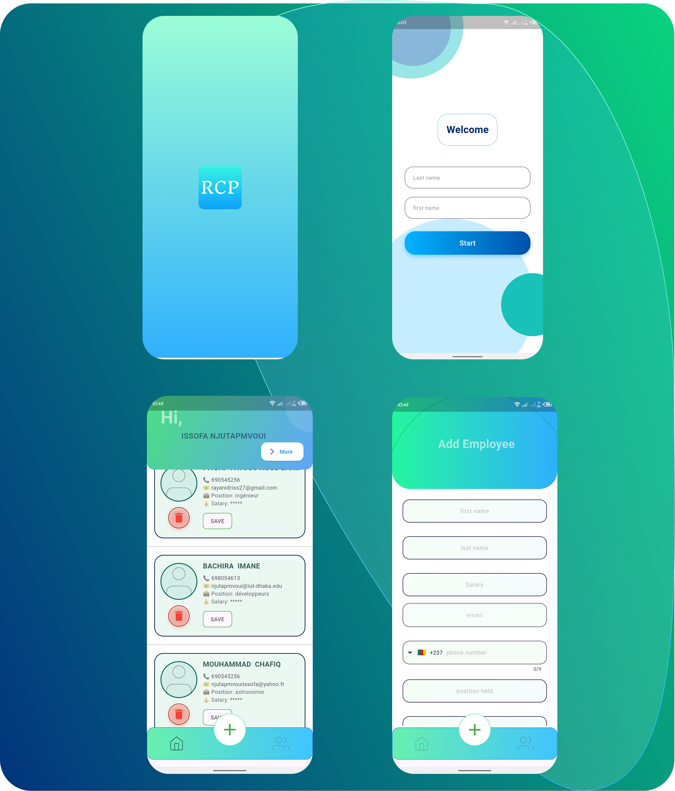

# 📱 RCP - Employee Management App  

**RCP** is a Flutter mobile application designed to simplify employee data management. It offers an intuitive interface for adding, editing, deleting, and recovering employee records, with offline storage via Hive.  

---

## 🚀 Features  
- **Secure Login**: Access the dashboard with first and last name authentication.  
- **Employee Dashboard**: View and manage employee records (name, email, phone, position, salary).  
- **CRUD Operations**: Add, edit, or delete employees seamlessly.  
- **Data Export**: Download employee details for offline use.  
- **Recycle Bin**: Restore accidentally deleted records or purge permanently.

## Screenshots of images

<div align="center">
  
  
  
  
  
</div>

## Screenshots of images on the smartphone


## 🧰 Tech Stack  
- **Flutter**: Cross-platform UI framework.  
- **Hive**: Lightweight NoSQL database for local storage.  
- **Dart**: Primary programming language.  

## 🛠 Installation  
```bash
git clone https://github.com/yourusername/rcp-employee-management.git
cd rcp-employee-management
flutter pub get
flutter run
